<h1 align="center">Hi, I'm Evelin 👋</h1>
<h3 align="center">Computer Systems Engineering Student</h3>

  

---

### 🔧 Tecnologías

  
  
  
  
  

---

### 📊 Estadísticas de GitHub

  

  

---

### 📈 Gráfico de contribuciones

  

---

<h3 align="center">🔗 Conéctate conmigo</h3>

  
  
  

