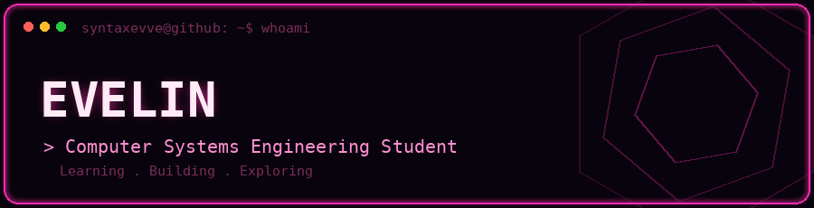
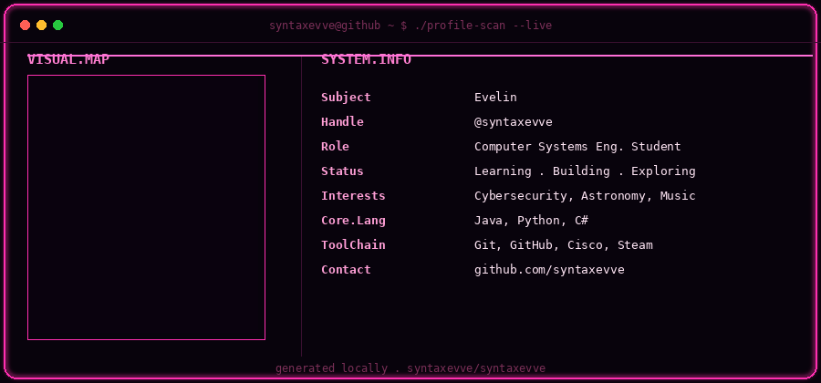

  

  

---

### 🔧 Tecnologías

  
  
  
  
  

---

### 📊 Estadísticas de GitHub

  

  

---

### 📈 Gráfico de contribuciones

  

---

<h3 align="center">🔗 Conéctate conmigo</h3>

  
  
  

  

